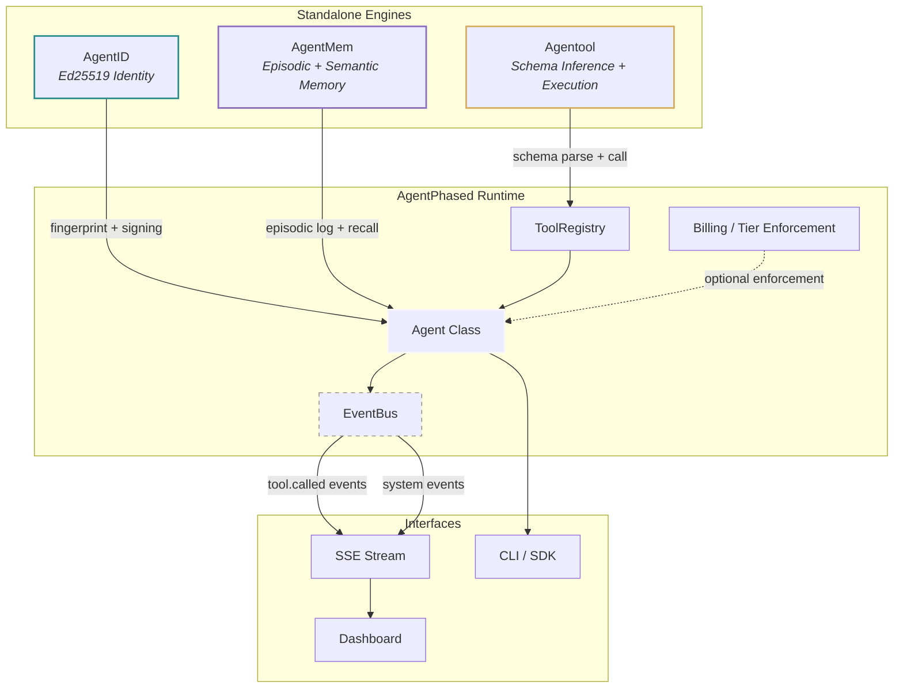

# AgentPhased

**The operating system for autonomous AI agents.**

Every AI framework gives your agent a brain. None of them give you a body. **AgentPhased** is the body: cryptographic identity, structured memory, and dynamic tool execution — three standalone, compiled engines that compose into a single, auditable runtime for agents operating in production.

---

## Architecture

AgentPhased follows a HashiCorp-style decoupled architecture: each pillar is a fully independent project that can be installed, tested, and deployed in isolation. The unification layer glues them together through a shared, thread-safe event bus, avoiding tight coupling or heavy inheritance.



---

## The Three Pillars

### AgentID — Cryptographic Identity
Every agent gets a deterministic Ed25519 keypair derived from its name and project namespace. No certificates. No OAuth dance. Just a public fingerprint that is reproducible, verifiable, and auditable across environments.
*   Deterministic key derivation from `(name, project)` tuple
*   Ed25519 signing and signature verification
*   Hex-encoded public key and fingerprint for cross-system correlation
*   Zero external dependencies

```python
from agentid import AgentIdentity

identity = AgentIdentity(name="sentinel", project="acme-corp")
print(identity.fingerprint)   # Deterministic, reproducible fingerprint
signature = identity.sign(b"payload")
```
*   **Repository:** [github.com/samvardhan03/AgentID](https://github.com/samvardhan03/AgentID)

---

### AgentMem — Persistent Memory
A compiled Rust core exposed to Python via PyO3. Not a vector database wrapper, but an engine. Episodic memory stores structured action logs on disk, while semantic memory runs HNSW approximate nearest-neighbor search over local ONNX embeddings.
*   Episodic memory: structured `(action, result_summary, timestamp)` logs
*   Semantic recall: HNSW approximate nearest-neighbor search
*   ONNX-based embedding generation running entirely on localhost (no external API calls)
*   RocksDB persistence with namespace isolation
*   Compiled Rust core, eliminating Python runtime database overhead

```python
from agentmem import Memory

mem = Memory(namespace="sentinel-abc123")
mem.log_episode(action="tool.called stripe listCharges", result_summary="12 charges returned")
results = mem.recall("billing query", top_k=5)
```
*   **Repository:** [github.com/Muskangujar/AgentMem](https://github.com/Muskangujar/AgentMem)

---

### 🛠️ Agentool — API Schema Inference & Execution
A Rust parser that reads OpenAPI specifications and raw HTML pages to automatically infer tool schemas. Includes a Tokio-based Model Context Protocol (MCP) server. The Rust core compiles to a native Python extension via PyO3.
*   Automatic schema inference from OpenAPI JSON/YAML and HTML documentation
*   Tokio-based async MCP server for tool discovery and invocation
*   Request signing via seamless AgentID integration
*   Schema caching via AgentMem integration
*   Native Rust parser compiled to Python via PyO3

```python
from agentool import Tool

tool = Tool("https://api.example.com/v1")
print(tool.schema)                          # Auto-inferred schema representation
result = tool.call("listUsers", limit=10)
```
*   **Repository:** [github.com/Muskangujar/Agentool](https://github.com/Muskangujar/Agentool)

---

## Unified Quickstart

Get your agent running locally in under a minute.

```bash
pip install agentphased
```

### Python API Usage
```python
from agentphased import Agent

# Initialize the operating system with identity and memory
agent = Agent(name="sentinel", project="acme-corp")

# Register and call an API tool (schema is inferred automatically)
agent.tools.add("https://api.stripe.com/v1")
result = agent.tools.call("https://api.stripe.com/v1", "listCharges")

# Every tool call is automatically logged to episodic memory for recall
history = agent.memory.recall("stripe charges")

# Subscribe to real-time event bus telemetry
agent.bus.subscribe("tool.called", lambda e: print(f"[{e['url']}] {e['method']}"))
```

### Run the Dashboard & Website
```bash
# Clone the repository
git clone https://github.com/samvardhan03/agent_phased.git
cd agent_phased

# Install the developer runtime
pip install -e .

# Launch runtime servers and visual interfaces
./start.sh
```
*   **Dashboard:** Runs at `http://localhost:5175` with a live SSE event stream connected directly to the internal EventBus.
*   **Marketing Website:** Runs at `http://localhost:5173` displaying the interactive, slide-based technical platform tour.

---

## Design Philosophy

AgentPhased borrows its architecture from the HashiCorp ecosystem (Vault, Consul, Nomad): build each tool as a fully standalone, production-grade system, then provide a thin orchestration layer for teams that want the integrated experience.

| Principle | Implementation |
| :--- | :--- |
| **Standalone First** | Each pillar has its own repository, test suite, and release cycle. |
| **Compiled Cores** | Identity, memory, and tool parsing are Rust, not slow Python wrappers. |
| **Event-Driven Glue** | The unification layer is a thread-safe pub/sub EventBus, avoiding inheritance. |
| **No Vendor Lock-in** | Zero cloud dependencies. Runs entirely on localhost via ONNX and RocksDB. |
| **Auditable by Default** | Every tool invocation is signed, logged, and streamable in real-time. |

---

## Project Structure

```
agent_phased/
  ├── agentphased/          # Python orchestration & unification layer
  │     ├── __init__.py     # Unified Agent class initialization
  │     ├── bus.py          # Thread-safe event bus implementation
  │     ├── _tool_registry.py # Managed tool bindings
  │     ├── billing.py      # Tier enforcement stubs
  │     └── server.py       # FastAPI telemetry & SSE server
  ├── dashboard/            # Vite + React real-time developer dashboard
  ├── apps/web/             # Vite + React marketing slide website (snapped, dark mode)
  ├── tests/                # Integration and module test suite
  ├── start.sh              # Multi-process development orchestrator
  └── pyproject.toml        # Unified package configuration
```

---

## Roadmap

| Status | Milestone |
| :--- | :--- |
| **Shipped** | Core Agent class with identity, memory, tools, and event bus |
| **Shipped** | Real-time SSE dashboard with live event streaming |
| **Shipped** | Snapped, slide-based developer marketing page |
| **Shipped** | Billing tier enforcement stubs |
| In Progress | CLI for agent lifecycle management |
| Planned | Multi-agent coordination via shared EventBus |
| Planned | Remote agent attestation via AgentID signatures |
| Planned | Plugin system for custom memory backends |

---

## License

Open source under the [MIT License](LICENSE).

Built by engineers who believe AI agents deserve real infrastructure, not demo scaffolding.
